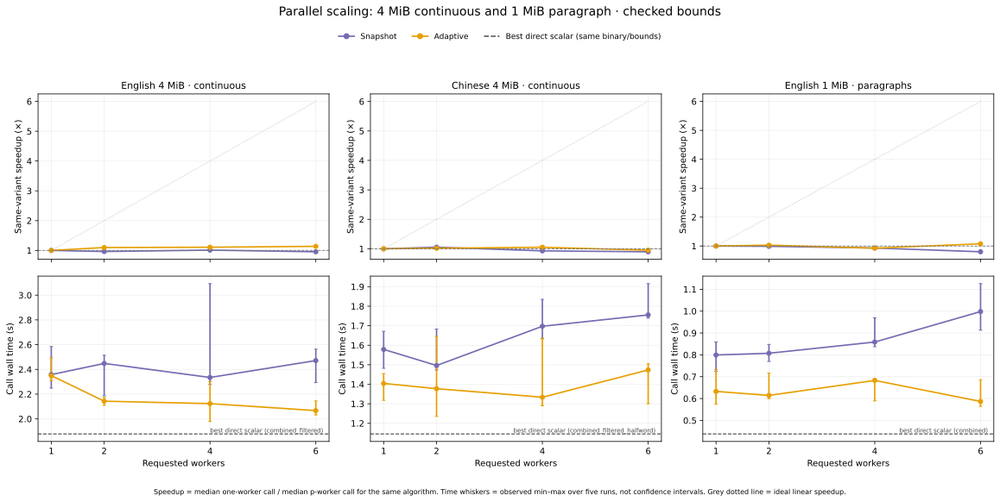

# Rust 原生消融与并行演进

本轮继续寻找跨语料结构和规模成立的速度—内存折中，不为某个 RAM 上限、数据集或线程数选一个唯一赢家。原项目的价值仍在于具体 occurrence 更新和跨度隐式邻接；原生测量进一步表明，pair 索引的组织比单纯减少语料数组字节更能影响整体结果。

正式性能数据来自同一个固定二进制，覆盖原有 Python 探索的表示、索引、队列与调度机制。分组汇总和收紧输入 Vec 容量的补丁已保存，但尚未应用或测量；并行扩展不佳后，后续工作转向跨领域算法调研与精确批次证书。不同二进制的数据不混在一起求中位数。

## 第一轮：单线程甜点

第一轮源码为 `b97666b`，共 25 个单线程版本。以下为七个真实样本的 checked 结果，每格为 **训练秒数 / 进程 VmHWM MiB**，五次独立进程的中位数。`archived` 是此前已经提交的原生基线；`packed` 是相同表示和索引路线在新共同驱动中的实现，两者都保留作为参照。

| 输入 | archived | packed | combined_filtered | arena_counted | combined_filtered_halfword |
|---|---:|---:|---:|---:|---:|
| 英 1 MiB regex | 0.0822 / 8.72 | 0.0800 / 8.76 | 0.0673 / 7.40 | 0.0691 / 7.58 | 0.0653 / 6.98 |
| 中 1 MiB regex | 0.1554 / 18.98 | 0.1521 / 19.51 | 0.1089 / 11.09 | 0.0981 / 9.51 | 0.0977 / 10.54 |
| 德 1 MiB regex | 0.1243 / 13.01 | 0.1442 / 13.15 | 0.0938 / 10.97 | 0.1182 / 10.30 | 0.1063 / 10.25 |
| 日 1 MiB regex | 0.1625 / 19.01 | 0.1807 / 19.54 | 0.1192 / 11.32 | 0.1297 / 10.41 | 0.1222 / 10.82 |
| 英 1 MiB paragraph | 0.5261 / 30.22 | 0.5151 / 30.34 | 0.4235 / 24.94 | 0.5575 / 27.54 | 0.4428 / 23.09 |
| 英 4 MiB regex | 0.1881 / 16.01 | 0.1869 / 16.03 | 0.1526 / 14.47 | 0.2135 / 14.51 | 0.1656 / 13.52 |
| 中 4 MiB regex | 0.5305 / 54.26 | 0.5931 / 58.67 | 0.3889 / 32.92 | 0.4429 / 31.96 | 0.4105 / 30.61 |

`combined_filtered` 是当前较稳的候选：把频率和位置 Vec 放进同一张表，并在初始化计数后排除低频 pair。相对 `packed`，七个真实样本的时间中位数减少 15.9%–34.9%，VmHWM 减少 9.7%–43.9%；这七组时间和内存的五次观测范围均与 `packed` 分开。它相对较强的 `archived` 也保持收益，因此结论不依赖新共同驱动里较慢的个别基线样本。

这两个改动的作用已经拆开验证：`separate_counted` 与 `combined_filtered` 使用相同的先计数初始化，后者时间减少 12.6%–27.6%，其中五组观测范围分开，支持单表减少重复查找的价值；`combined` 改成 `combined_filtered` 后，总内存减少 19.8%–54.6%，但耗时变化在各次观测范围内，预筛的主要稳定收益在空间。

Arena 在中文样本中很有竞争力，但英文 paragraph 和 4 MiB regex 上更慢；不能沿用 Python 结果直接说它普遍不划算，也不能把位置池设成统一默认。半字 corpus 与筛选索引组合后，在这七个样本里又比 `combined_filtered` 减少 4.4%–7.4% VmHWM；时间有增有减。它是可保留的空间方向，需要同时注意初始 alphabet 限制和实际 Vec capacity。

## 哪些 Python 结论在 Rust 中改变了

- 半字位图相对同为 tuple key、四写端点的 `endpoints`，七个真实样本的时间变化为 −6.7% 到 +6.6%，观测范围全部重叠。Python 中明显的解码惩罚没有原样保留到 Rust。它相对 `packed` 较慢还混入了 tuple/u64 key 差别，因此不能把该差距全部归于位图。
- `lean` 相对四写端点的时间变化为 −6.7% 到 +9.2%，同样尚未分辨出稳定优势。减少写次数仍是明确的操作量变化，但完整训练中它未必主导时间。
- tuple key 改为 u64 后，七个真实样本的中位数均较低，减少 4.1%–15.2%，只有两组观测范围完全分开。Rust 中两种 key 都是 8B，收益与 Python tuple 对象压缩不是同一种机制。
- 融合与拆开读取接口的 native 对照大多无法从观测波动中区分。Rust 内联和编译器消除重复读取改变了这项消融的常数，Python 方法调用次数不是原生性能的替代指标。
- `linked12` 的 VmHWM 比 `endpoints` 高 13.2%–27.1%，七组范围全部分开；时间中位数高 3.0%–33.1%，只有一组范围分开。端点省掉逐位置前后指针的空间价值在 Rust 里依然存在。本实验的 linked 版本没有移植 YTTM 的 RLE，不能据此评价完整 YTTM。
- H3/H2.5 的语料缓冲更小，但这轮没有显示跨输入的速度领先；H2.5 在 Rust 中也没有复现 Python 中同样明显的惩罚。完整结果保留这些负面和未分辨项。

范围重叠仅说明五次实验不足以分辨相应幅度，不表示已经证明等速；这些 min/max 也不是统计置信区间。全部 18 类输入、25 个版本、两种访问模式的范围见 [单线程汇总](ablation_results/scalar-summary.md)。

## unsafe 的实际作用

unchecked 路径使用私有 `get_unchecked`/`get_unchecked_mut`，覆盖热路径语料、紧凑布局元数据及已验证 token ID 的长度表访问。公开入口仍校验输入，历史位置有效性和必要的算术检查仍保留。新 ID 先加入长度表再写入语料；并行快照在经过验证的不相交跨度上使用原子访问。边界契约和只读审计记录随源码保存。

第一轮 18×25＝450 组 checked/unchecked 对照中，440 组的五次时间观测范围重叠，7 组 unchecked 较快且范围分开，3 组反而较慢且范围分开。证据不支持统一开启 unsafe 就会普遍提速；它作为可测选项保留。此处是整个训练的结果，不能据此断言编译器生成的每一次数组访问都相同。

## 队列与长链边缘情况

高低频队列固定使用 `endpoints` 的 tuple key 和四写布局，公平参照是 `endpoints` 堆版。加权总量平方根阈值对统一放大权重敏感；用所有 piece 权重的 GCD 归一化排序分数，可以保持原始精确频次和规则，同时恢复相同的队列形状。

| 英 1 MiB，权重倍率 | 端点堆 / 秒 | 原高低频队列 / 秒 | GCD 队列 / 秒 | 原队列高频扫描 | GCD 高频扫描 |
|---|---:|---:|---:|---:|---:|
| 1 | 0.1010 | 0.0834 | 0.0890 | 8,483 | 8,483 |
| 64 | 0.1122 | 0.1048 | 0.0895 | 371,285 | 8,483 |

权重×64 同时将最低频率×64；物理语料不变。这里消掉的是权重表示变化带来的额外扫描，不是新的 BPE 渐近界。若权重互质或总量极大，归一化未必缩小阈值；超过显式桶容量上限时退回 heap，避免按巨大权重申请内存。它仍不等于完整 Re-Pair 或 YTTM 队列算法。

`full_clear` 的额外工作为每次替换跨度之和 ΣL；合法贪心长链可达平方级。Rust 批量清零大幅降低了这项常数，在 2k–16k 链长内，完整训练的差距远小于 Python。端点写入仍消除了长度相关工作，边界组件微基准另测更长跨度，不把整体中小样本的近似时间说成渐近等价。

## 多线程：当前结果没有达到目标

下表是已完成五次重复的 `call_seconds` 中位数，包含初始化、合并、输入验证、最终提取和销毁，不含 fixture 的 JSON 解析。加速比相对同一算法的 1 worker；“最佳串行”取相同输入下已测直接串行候选的最低时间中位数。

| 输入 / 方案 | 1 worker / 秒 | 2 worker 加速 | 4 worker 加速 | 6 worker 加速 | 4 worker / 秒 | 最佳串行 / 秒 |
|---|---:|---:|---:|---:|---:|---:|
| 英 4 MiB 连续 / snapshot | 2.3581 | 0.96× | 1.01× | 0.95× | 2.3348 | 1.8783 |
| 英 4 MiB 连续 / adaptive | 2.3499 | 1.10× | 1.11× | 1.14× | 2.1233 | 1.8783 |
| 中 4 MiB 连续 / snapshot | 1.5785 | 1.06× | 0.93× | 0.90× | 1.6973 | 1.1454 |
| 中 4 MiB 连续 / adaptive | 1.4041 | 1.02× | 1.05× | 0.95× | 1.3336 | 1.1454 |
| 英 1 MiB paragraph / adaptive | 0.6326 | 1.03× | 0.93× | 1.08× | 0.6830 | 0.4381 |

这些数字不支持“充分利用多核”的结论。完整 piece 所有权方案在已有分片的中文 4 MiB regex、英文 paragraph 上四 worker 分别约有 1.27–1.38×、1.38–1.40× 自身加速，但绝对耗时仍输给更强的直接串行实现；对全文单 piece，它们实际只有一个 worker，不能解决连续文本的扩展。

瓶颈可从阶段时间直接看到。英文连续输入的四 worker snapshot，中位初始化约 0.357s、串行选位置约 0.184s、串行 reducer 约 0.948s，已占据大部分 2.335s 调用耗时。adaptive 减少了细碎任务的屏障，却让 3,000 轮中的 2,806 轮串行执行；中文对应为 2,990 轮。其 CPU 时间/墙钟在四 worker 时分别约 1.09 和 1.00。`sync_seconds` 已包含在 plan/apply 中，不能再次相加。各阶段中位数也不应当作同一条运行精确相加的分解。

四 worker snapshot 的 VmHWM 约为英文 105.44 MiB、中文 107.47 MiB，较相应最佳串行的 95.47、96.57 MiB 更高。已有 regex 分片上，中文 broadcast 四 worker 约 91.66 MiB、owner 约 104.89 MiB，直接 `combined_filtered` 为 32.92 MiB；局部哈希表和分片分配开销需要计入，不能只展示主 corpus 的字节数。

因此下一轮重点是减少全局串行工作及规则间同步，而不是继续微调 grain 或 unsafe。严格频率上界、保守候选前缀、局部状态所有权和有界推测的比较见 [重新设计并行训练](PARALLEL_RETHINK.md)。

## 一字节长跨度组件与长链

ByteSpans 的 3,150 次组件计时全部通过相同 checksum 检查；其中长度 255、256、65,535、65,536 的边界数组均保持每个原始位置 1B。原 u8-only 在超过 255 时显式跳过。这只解决边界表示，不包含 token ID，也没有把完整训练器压缩成 1B/位置。

近似固定 131k 位置、同样数量的预生成合并操作下，chain 长度从 32 增到 65,536，`full_clear` checked 中位数从 3.271ms 增到 483.544ms，`lean` 从 1.273ms 到 1.058ms。最后一组组件耗时相差约 457×，说明整跨度清零的边缘复杂度确实会显现；这个倍数不能当作完整 BPE 训练提速。[组件汇总](ablation_results/topology-summary.md)

## 新方向的原生诊断：精确候选前缀

后续源码 `1c2fffc` 新增 `certified_prefix_probe`。它使用 `combined_filtered` 的后端与索引，预取已证明安全的候选连续前缀，仍然逐规则串行应用。这里测的是可减少多少规则间同步，不是实现了多少多线程提速。

| 输入 | 规则数 | 安全批次 | 平均规则/批 | 最大批宽 |
|---|---:|---:|---:|---:|
| 英 4 MiB 连续 | 3,000 | 251 | 11.95 | 47 |
| 中 4 MiB 连续 | 3,000 | 275 | 10.91 | 50 |
| 英 1 MiB paragraph | 3,000 | 253 | 11.86 | 59 |
| 英 4 MiB regex | 3,000 | 269 | 11.15 | 44 |
| 中 4 MiB regex | 3,000 | 237 | 12.66 | 62 |
| 合并长链 16k | 15,999 | 15,999 | 1.00 | 1 |

全部 20 个 fixture、两种 bounds、probe 与同构建直接参照，共 80 次诊断运行的输出 fingerprint 一致；两种 bounds 的批次计数完全相同。这里每项只跑一次，不据此作耗时优劣比较。另有 448 次独立 Python recount 完整轨迹对照。证明、反例、原生独立语义测试和后续按整个批次生成最终邻接的方向见 [并行重设计](PARALLEL_RETHINK.md) 与 [诊断明细](ablation_results/certificate-summary.md)。

证书相对每规则一个 epoch，有机会将这些真实输入的 epoch 数压低约九成。但频率表归并、负载平衡、批内边界和内存带宽依然存在。长链与 self-pair run 明确退化为单步；现在没有四核 3× 的实现或测量结果。

## 容量与结果边界

中文 4 MiB regex 的 endpoint 逻辑缓冲为 4,875,412B，输入 Vec 实际 capacity 为 8,388,608B。紧凑后端重新分配数组，部分差距来自不同预留策略。独立 shrink 补丁已保存，尚未测量；`shrink_to_fit` 也可能产生瞬时重分配峰值，不能预先承诺 VmHWM 会下降。

全部训练性能矩阵共有 5,860 次正式运行、1,172 个五重复组合；边界组件另有 3,150 次计时和 150 个显式 u8 超长跳过。所有训练组合在同一输入/规则数/阈值下的输出 fingerprint 一致。首次固定源码经过 23 项 Rust 测试、严格 Clippy 和 4,772 次完整轨迹 oracle 对照；16 个 u16 初始 alphabet 超限按预期拒绝。后续批次探针单独验证，不把它混入上述性能结论。

运行环境只有 6 个可见 vCPU、一个可见 NUMA 节点。当前数据不能代替双路 Xeon 的物理多核验收，也不能把失败的扩展全部归于环境。源码、原始数据、配置、hash 和逐项中位数/范围见 [结果目录](ablation_results/README.md)。

第一轮并行横轴是 worker 请求数，所有并行进程均允许使用六个可见 CPU，部分模式另有协调线程。因此它是 worker 数扩展实验，不是严格限定四个 CPU 的验收。后续 runner 增加 `--parallel-core-budget workers`，将协调线程也限制在 p 个 CPU 预算内；1/4 预算的协议 smoke 已通过，尚未用它重跑正式性能矩阵。
