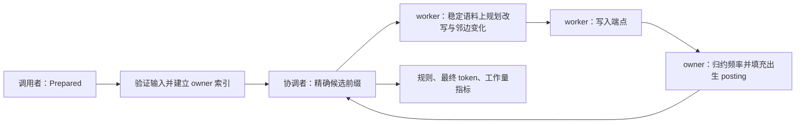

# 本分支主算法与 2024 年版本的差距

本分支选定 **唯一 owner、分组出生链、内联 posting、aHash 的精确批量 BPE** 为主要实现。代码位于 [`src/parallel`](src/parallel/mod.rs)，默认命令为 `ebpe`，库入口为 `train_parallel`。它从已测的 `owned_integer_hash` 原型提升而来，采用 lazy heap、4096 个位置一块的任务、默认至多四个 worker；没有混入 adaptive cuts、位图、重放或近似批次。

“选定”表示本轮候选比较后的工程默认。英文完整规模复核中它最快；中文 adaptive 和 chain 略快但范围与 owner 交叠。现有证据支持收敛为一套简单实现，没有证明某一种实现对所有输入最优。

## 从输入到规则

调用者提供 `Prepared`：一份带永久分隔符的数字语料、初始长度表、权重段起点和正整数权重。可以是一整份连续文本，也可以是已有语义边界内的加权片段。物理任务切块不插入分隔符，长 token 可以跨任务边界。文本准备与模型编码属于调用者；[使用说明](README.md)给出保留原文的 UTF-8 准备命令。

以下为训练核心的 C4 组件视图；图中组件均在同一 Rust 进程内，箭头表示每批执行次序。

pair key 为 `(u64(left_id) << 32) | right_id`。每个 key 通过固定映射落到一个 owner；owner 同时持有该 key 的频率、候选堆项和历史位置表。热 pair 的位置表仍可拆成多个任务并行扫描，不由 owner 单线程执行所有改写。worker 持有投递到各 owner 的临时变化，owner 各自更新自己的表，避免每个 worker 保存整套索引。

posting 保留可能失效的历史位置，在选中使用时核对端点。前两个位置内联在 16 字节 `SmallPosting` 中，更长的表使用唯一拥有的堆分配。这个 16 字节是本机 64 位布局，不是整进程内存或可移植 ABI 保证。selected posting 移出 owner，在规划后释放；初始化路由、改写 Plan、出生链和表容量仍有额外峰值。

新邻接按 pair key 分组。每个 producer→owner 路由用 `BirthNode { pos, next }` 串起同一 key 的出生位置，并累计加权频率和物理出现数。owner 先完整归约、检查最小频率，再按物理出现数预留 posting 容量，一次查表后沿链填入全部位置。少数高权重出现不能被误当作很多物理位置。每条临时 BirthNode 为两个 u32、8 字节；换来的是少做逐位置的端点解码和哈希查找。

## 为什么批次仍等价于逐条 greedy

规则按加权频率降序、同频 `(left_id,right_id)` 升序排列，每条规则分配严格递增的 fresh ID。批次最多 256 条，只取当前候选的连续前缀。如果下一候选的左 ID 已出现在本批右端，或右 ID 已出现在本批左端，就立即停止；不跳过冲突者寻找后面的低频 pair。`AA` 自重复规则单独成批。

这个条件使批内被选 pattern 的出现不重叠。批中新边 `(L,Zi)`、`(Zi,R)`、`(Zi,Zj)` 分别来自旧边 `(L,Ai)`、`(Bi,R)`、`(Bi,Aj)`；每种新边的加权频率不超过相应旧祖先。祖先与已选 pattern 冲突，因此在这个连续前缀之后。同频时 fresh ID 又使新边排在祖先之后，新边不会抢占已选规则。完整推导及反例见 [候选前缀证明](PARALLEL_RETHINK.md#候选一有证明条件的连续候选前缀)。这是一种充分条件，会保守地缩小批次。

顺序正确还不足以保证并发更新正确。所有任务先从稳定的批前语料规划，识别相邻匹配最终产生的 fresh/fresh 邻边，共用邻边只结算一次。端点写入完成、任务 join 后，才归约并填充 owner 的索引；全部 owner 完成后才开始下一批。语料使用 checked `AtomicU32` 访问，不开放 unchecked 端点路径。私有 `SmallPosting` 的 raw allocation 所有权保留独立安全说明和生命周期测试。

`AA` 的历史位置先排序、过滤，再按 run 的奇偶摘要选择从左到右的不重叠匹配。跨任务边界传播的是 run 奇偶，不依赖空格或文档边界。所有 worker 数遵循相同规则与最终 token 语义。

## 2024 年的哪个版本

这里的“当年版本”指本仓库最后一条 2024 年提交 **`7bfbc63`，2024-09-09**，同时包含 [`ebpe.py`](../ebpe.py) 的 v1 与 [`ebpe_v2.py`](../ebpe_v2.py) 的 v2。它不是 Hugging Face 2024 年源码，也不是后来的共同核心 Python 重写。原始两个文件保持不变，供历史复现。

当年的核心思路已成立：索引具体出现位置，只改受影响邻边，用端点信息定位相邻 token，并用惰性优先队列避免每轮重扫整个语料。当前主实现继承了这些基础；主要变化是统一规则契约、去除已发现的局部成本、压缩对象布局，并在精确批次内分配状态和工作。

| 方面 | 2024 v1：`ebpe.py` | 2024 v2：`ebpe_v2.py` | 本分支主实现 |
|---|---|---|---|
| 训练热路径 | Python 字符串 pair、切片及拼接 | Python 数字 ID、扁平 u32 语料 | Rust u64 pair key、u32 端点、u64 频率 |
| 文本边界 | 换行、空格和指定标点变为 `#` | 接口先 `split()`、Counter 加权 | 调用者决定边界；支持连续全文，无强制预分词 |
| 位置索引 | 每 pair 一个 `array('I')`，4 字节位置 | 每 pair 一个 `array('Q')`，8 字节位置 | owner 独占 SmallPosting，4 字节位置，小表内联 |
| token 长度 | 每原始位置一个 u8，超过 255 会溢出 | 独立 Python 长度表 | 每 token 一个 u32 长度，显式检查溢出 |
| 合并写入 | 修改边界；热路径仍处理字符串 | 将合并 span 的全部内部位置清零 | 只修改被吞边界及新端点，写入次数不随 span 长度增长 |
| 频率/队列 | 全局 Python 字典与堆 | 全局 Python 字典与堆 | 每 key 一个 owner 的频率、posting 和惰性堆；全局选精确前缀 |
| 并行 | 训练主循环单线程 | 训练主循环单线程 | 原生 worker 规划、应用与 owner 归约；无需空格边界 |
| token 身份 | 以字符串作为身份 | 同字符串可能复用 raw ID，附加首尾标志 | 每规则 fresh ID，不按展开字符串合并身份 |
| 参数边界 | `freq <= min_freq` 即停止，实际要求严格大于 | 最小频率为包含边界；有长度、前后缀等接口 | 频率 `>= min_frequency`；`--rules` 是最大合并数 |
| 产品接口 | Python 训练、若干分词方法与词表 JSON | tokenizer 原型，部分接口为占位 | Prepared 训练库和 CLI、规则及最终 token；完整 tokenizer API 未迁移 |

有两项行为差异必须保留在比较里。v1 对 `AA` 从右向左挑选不重叠位置，当前契约为从左到右；v1 的字符串排序与当前数字 ID 排序也不是同一 tie 规则。v2 按字符串复用身份，当前 fresh ID 证明依赖于不复用身份。因此新主实现不是两份旧代码的逐条规则兼容补丁；正确性参照是独立完整重算的 fresh-ID greedy oracle。

此前审计还确认 v2 在长度限制排除新邻边时漏减已经消失的旧边频率，例如 `max_piece_length=2`、`aba` 会继续学习不存在的 `ba`；主实现没有最大 token 长度过滤参数。v2 的带切片 bisect、整段清零、训练末尾无条件展开打印等成本也未带入。诊断、定向复现和修复实验见 [原始源码审计](../benchmarks/research_archive/research.md)。前后缀、特殊 token 和 alphabet 裁剪需要单独接口适配，不能从核心门控推导已兼容 HF。

## 性能差距能确认到什么程度

没有一组“2024 原版→当前主实现、完全相同契约”的完整规模计时，因而不报告相对原版的单一倍数。早期审计数据有不同的切分、阈值、词表和重叠规则；Python→Rust 的常数收益也不能全部算作并行算法收益。

目前可确认的是同一补测窗口、相同 Prepared、相同 fresh-ID greedy 契约下的候选对比。Wikipedia 英中各 16 MiB，连续单 piece，实际 32,000 次合并、最低频率 2；每格两次，中位秒数如下。

| 模式 | 英文 | 中文 |
|---|---:|---:|
| 公平直接串行 CF32/aHash/checked，W1 | 5.119 | 2.669 |
| 直接串行 CF16/aHash/unchecked，W1 | 5.037 | 2.906 |
| 选定 owner/grouped/inline/aHash，W4 | **2.591** | **1.641** |
| adaptive cuts，W4 | 2.915 | 1.577 |
| 出生链控制，W4 | 2.908 | 1.594 |
| 内联计数重放，W4 | 3.627 | 1.987 |

选定方案相对每种语言本窗最快直接串行为 **1.94×、1.63×**。中文 adaptive/chain/owner 的观测范围交叠，不能确认稳定细微排序。inline replay 相对同二进制 chain 两种语言都慢约 25%，所以不作为默认。选定方案的训练后 VmHWM 为英文 251.6 MiB、中文 165.7 MiB，含此前输入解析高水位，不能与 v1 的 u8 数组载荷直接比较。

上述时间来自冻结实验二进制；提升到主包后重新核对完整结果，不把正确性复核的单次耗时替换为新的性能排名。完整范围、CPU 时间、二进制/源码/输入哈希见 [正式核心复核](batch_results/radical-full-v1/README.md)。它是有限候选比较，未取得通用四核 3×、几十核或双路扩展性结论。

Hugging Face 2024 年源码是另一个比较对象；本节的“当年版本”只指本仓库的 v1、v2，不混入跨库或跨 tokenizer 配置的速度倍数。

## 成本、验证与维护

每次真实合并减少一个活 token；使用 fresh ID 时，旧 pair 不再获得新出现。新增位置记录总量受真实合并次数控制，但总运行时间还包含哈希、堆、权重查询、AA 排序、owner 候选扫描及同步。不能只从一次局部 O(1) 改写宣称整个算法线性。worker→owner 路由头有 O(W²) 成本，协调者每条规则扫描至多 W 个 owner 头，热点 key 和后期小批次仍限制扩展。

主包保留原型的完整规则/频率/最终 token 测试，包括随机加权输入、相邻批内规则、AA、宽 ID、长 token 和 SmallPosting 移动/增长/析构；另用 Python naive 完整轨迹核对 CLI 和默认设置。`tools/verify_primary.py --full-fixtures` 再核对两份 16 MiB 的全部训练结果指纹。验证记录见 [提升核验](results/primary-verification.json)，源码对应关系及检查汇总见 [提升出处](results/primary-promotion.json)。本次主包 65 项测试、41 次独立 CLI 轨迹核对、两次完整规模指纹、`fmt`、全目标 strict Clippy 和 release 构建均通过。

后续修改以 `src/parallel` 为主。`experiments/radical/owned_integer_hash` 是冻结实验出处，历史报告和原始测量保持原样。旧库 `train` 与 `efficient-bpe-rust` 命令保留为标量参考；`ablation` 和其他原型用于研究对照。主实现的选择已收敛，不按语言名字硬编码算法切换。
